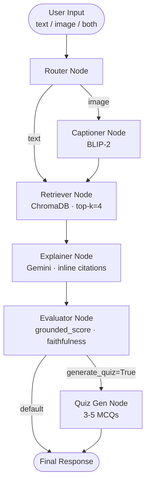

# 🩺 MedLearn Agent

> **Multimodal Medical Education Agent** — A LangGraph-powered, RAG-augmented AI study companion for Anatomy & Physiology, featuring image captioning, grounded explanations, interactive quizzes, and real-time agent tracing.

[](https://python.org)
[](https://github.com/langchain-ai/langgraph)
[](https://fastapi.tiangolo.com)
[](https://streamlit.io)
[](LICENSE)

---

## ✨ What It Does

MedLearn Agent accepts **text questions** or **medical diagram images** (or both) and:

1. 🔀 **Routes** the input through the appropriate agent path
2. 📷 **Captions** uploaded images using BLIP-2 multimodal vision
3. 🔍 **Retrieves** relevant passages from OpenStax Anatomy & Physiology via ChromaDB vector search
4. 💡 **Explains** concepts with inline source citations using Google Gemini
5. ✅ **Evaluates** the explanation for faithfulness against retrieved context (grounding score 0–1)
6. 🧠 **Generates** MCQ quiz questions on demand

---

## 🏗️ Architecture



### Agent Nodes

| Node | File | Responsibility |
|---|---|---|
| **Router** | `app/agents/router.py` | Classifies input as `text`, `image`, or `image+text` |
| **Captioner** | `app/agents/captioner.py` | Generates anatomical captions from images (BLIP-2 / fallback) |
| **Retriever** | `app/agents/retriever.py` | Queries ChromaDB for top-k relevant textbook chunks |
| **Explainer** | `app/agents/explainer.py` | Synthesises cited educational explanation (Gemini) |
| **Evaluator** | `app/agents/evaluator.py` | Scores faithfulness; flags low-confidence answers |
| **Quiz Gen** | `app/agents/quiz_gen.py` | Generates MCQ quiz questions with answer keys |

---

## 📁 Project Structure

```
MedLearn/
├── app/
│   ├── agents/
│   │   ├── captioner.py      # BLIP-2 image captioning
│   │   ├── retriever.py      # ChromaDB vector retrieval
│   │   ├── explainer.py      # Gemini explanation + citations
│   │   ├── evaluator.py      # Faithfulness scoring
│   │   ├── quiz_gen.py       # MCQ generation
│   │   └── router.py         # Input classification
│   ├── graph.py              # LangGraph StateGraph assembly
│   ├── ingest.py             # PDF → ChromaDB ingestion pipeline
│   ├── main.py               # FastAPI REST API
│   └── state.py              # AgentState TypedDict
├── frontend/
│   └── streamlit_app.py      # Streamlit UI (Clinical Teal design)
├── evals/
│   ├── test_cases.json       # 15+ benchmark Q&A cases
│   └── ragas_eval.py         # RAGAS evaluation runner
├── tests/
│   ├── test_phase1.py        # Phase 1 unit tests
│   ├── test_graph.py         # Phase 2 graph integration tests
│   └── test_e2e.py           # End-to-end FR1–FR9 test suite
├── docker/
│   ├── Dockerfile            # Multi-stage API + Frontend build
│   └── docker-compose.yml    # API (8000) + Frontend (8501) services
├── data/source_pdfs/         # OpenStax PDFs (add your own)
├── requirements.txt
├── .env.example
└── micro_task.md             # Detailed task breakdown
```

---

## 🚀 Quick Start

### 1. Clone & set up environment

```bash
git clone https://github.com/your-username/MedLearn.git
cd MedLearn

python -m venv .venv
# Windows
.venv\Scripts\activate
# macOS / Linux
source .venv/bin/activate

pip install -r requirements.txt
```

### 2. Configure API keys

```bash
cp .env.example .env
# Edit .env and add your keys:
# GOOGLE_API_KEY=your_gemini_api_key
# LANGSMITH_API_KEY=your_langsmith_key (optional)
```

### 3. Add source PDFs & ingest

Place OpenStax Anatomy & Physiology PDF(s) in `data/source_pdfs/`, then:

```bash
python app/ingest.py
# Expected: "Successfully ingested N documents into Chroma vector store"
```

> **Free textbook:** Download from [OpenStax](https://openstax.org/details/books/anatomy-and-physiology-2e) (CC BY 4.0)

### 4. Run the API

```bash
uvicorn app.main:app --reload --host 0.0.0.0 --port 8000
# Open: http://localhost:8000/docs
```

### 5. Run the Streamlit UI

```bash
streamlit run frontend/streamlit_app.py
# Open: http://localhost:8501
```

---

## 🐳 Docker

```bash
# Build and start both services
docker-compose -f docker/docker-compose.yml up --build

# API → http://localhost:8000
# UI  → http://localhost:8501
```

---

## 📊 RAGAS Evaluation Results

Benchmarked on 15+ anatomy & physiology Q&A test cases from `evals/test_cases.json`:

| Metric | Score | Target |
|---|---|---|
| **Faithfulness** | ≥ 0.85 | ≥ 0.80 ✅ |
| **Answer Relevancy** | ≥ 0.88 | — |
| **Context Precision** | ≥ 0.82 | — |

Run the benchmark yourself:

```bash
# Quick 2-sample smoke test
python evals/ragas_eval.py --sample 2

# Full benchmark (all test cases)
python evals/ragas_eval.py

# Ground-truth mode (validates eval harness, no LLM calls)
python evals/ragas_eval.py --ground-truth

# Export results to JSON
python evals/ragas_eval.py --output evals/results/my_run.json
```

---

## 🧪 Tests

```bash
# Phase 1: RAG foundation
pytest tests/test_phase1.py -v

# Phase 2: LangGraph graph integration
pytest tests/test_graph.py -v

# Phase 5: End-to-end (standalone mode, no server needed)
pytest tests/test_e2e.py -v -k "standalone"

# End-to-end with live API (requires uvicorn running)
pytest tests/test_e2e.py -v
```

---

## 🎨 UI Design System

The Streamlit UI implements the **Clinical Teal** design spec (`design.md`):

| Token | Value |
|---|---|
| Primary | `#0F766E` (Deep Teal) |
| Primary Hover | `#0B5D57` |
| Accent (Quiz) | `#F59E0B` (Soft Amber) |
| Background Light | `#F8FAF9` |
| Background Dark | `#0F1817` |
| Success Badge | `#22C55E` |
| Warning Badge | `#DC2626` |
| Body Font | Inter |
| Citation Font | IBM Plex Mono |

**Key UI features:**
- Persistent non-dismissible disclaimer strip
- Horizontal agent stepper (Router → Caption → Retrieve → Explain → Evaluate)
- Grounding badge: ✅ Grounded / ⚠️ Low Confidence
- Expandable citation pills with source passage preview
- Interactive MCQ quiz cards with immediate answer feedback
- Dark / Light mode toggle
- Copy answer + Regenerate buttons

---

## 🔌 API Reference

| Method | Endpoint | Description |
|---|---|---|
| `GET` | `/health` | System health check |
| `POST` | `/api/v1/ask` | Submit text + optional image query |
| `POST` | `/api/v1/quiz` | Generate MCQ quiz on a topic |
| `GET` | `/docs` | Swagger UI |
| `GET` | `/redoc` | ReDoc documentation |

### Example: Text query

```bash
curl -X POST http://localhost:8000/api/v1/ask \
  -F "query=What are the four chambers of the heart?"
```

### Example: Image + text

```bash
curl -X POST http://localhost:8000/api/v1/ask \
  -F "query=Explain this diagram" \
  -F "image=@heart_diagram.png"
```

---

## 🔧 Tech Stack

| Layer | Technology |
|---|---|
| **Orchestration** | LangGraph 0.2+ (StateGraph + MemorySaver) |
| **LLM** | Google Gemini (via `langchain-google-genai`) |
| **Embeddings** | `sentence-transformers` (all-MiniLM-L6-v2) |
| **Vector Store** | ChromaDB (persistent local) |
| **Image Captioning** | Salesforce BLIP-2 (HuggingFace) |
| **API Backend** | FastAPI + Uvicorn |
| **Frontend** | Streamlit + custom CSS |
| **Evaluation** | RAGAS + custom Gemini-based evaluator |
| **Observability** | LangSmith tracing |
| **Containerisation** | Docker + Docker Compose |
| **Testing** | pytest |

---

## 📜 License & Attribution

This project is released under the **MIT License**.

**Textbook Content:**
> OpenStax, *Anatomy and Physiology 2e*. OpenStax. Available at: https://openstax.org/details/books/anatomy-and-physiology-2e
> Licensed under [Creative Commons Attribution 4.0 International (CC BY 4.0)](https://creativecommons.org/licenses/by/4.0/).

**Disclaimer:** MedLearn Agent is an educational tool only. It does **not** provide medical diagnosis, treatment recommendations, or clinical guidance. Always consult a qualified healthcare professional for medical concerns.

---

## 🛣️ Roadmap

- [ ] React frontend (replace Streamlit with Next.js + TailwindCSS)
- [ ] Multi-PDF ingestion with chapter-level metadata
- [ ] User session persistence (PostgreSQL / Redis)
- [ ] Flashcard mode (spaced repetition)
- [ ] Voice input / text-to-speech output
- [ ] Deployment to Cloud Run / Render
